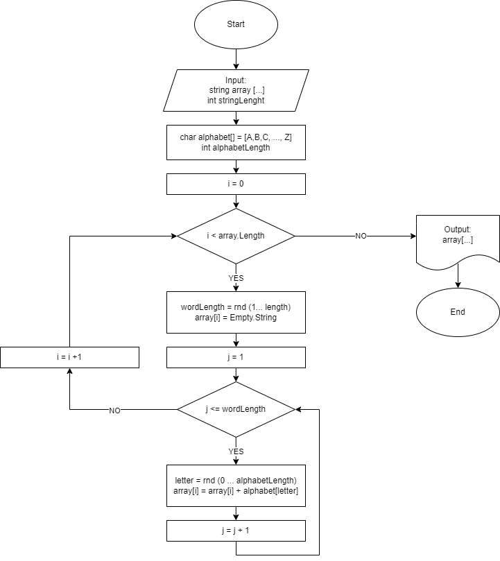
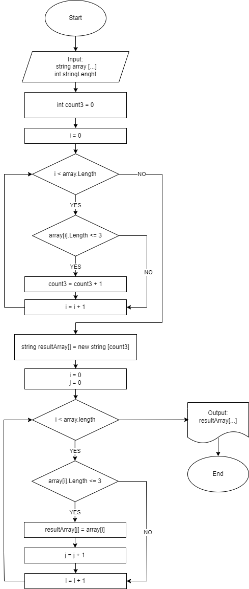

Итоговая контрольная работа по основному блоку
1. Создать репозиторий на GitHub
2. Нарисовать блок-схему алгоритма (можно обойтись блок-схемой основной содержательной части, если вы выделяете её в отдельный метод)
3. Снабдить репозиторий оформленным текстовым описанием решения (файл README.md)
4. Написать программу, решающую поставленную задачу
5. Использовать контроль версий в работе над этим небольшим проектом (не должно быть так, что всё залито одним коммитом, как минимум этапы 2, 3, и 4 должны быть расположены в разных коммитах)

Задача: Написать программу, которая из имеющегося массива строк формирует новый массив из строк, длина которых меньше, либо равна 3 символам. Первоначальный массив можно ввести с клавиатуры, либо задать на старте выполнения алгоритма. При решении не рекомендуется пользоваться коллекциями, лучше обойтись исключительно массивами.

Примеры:
[“Hello”, “2”, “world”, “:-)”] → [“2”, “:-)”]
[“1234”, “1567”, “-2”, “computer science”] → [“-2”]
[“Russia”, “Denmark”, “Kazan”] → []

Решение:
1. Создаем стандартные методы для ввода и создания массива для обработки. 
2. Вводятся значения числа элементов массива и максимальное длина строки.
3. Массив заполняется случайными значениями из зашитого в метод алфавита (случаен набор символов и длина каждой строки).
4. Далее запускается метод по созданию и заполнению массива со строками равными или короче трех символов.
5. Внутрим метода сначала ведется подсчет таких строк по условию и создается результирующий массив по числу этих строк.
6. Далее аналогичным циклом с условием этот массив заполняется.

Блок-схема метода заполнения массива случайными строками.

Блок-схема метода создания и заполнения результирующего архива.

